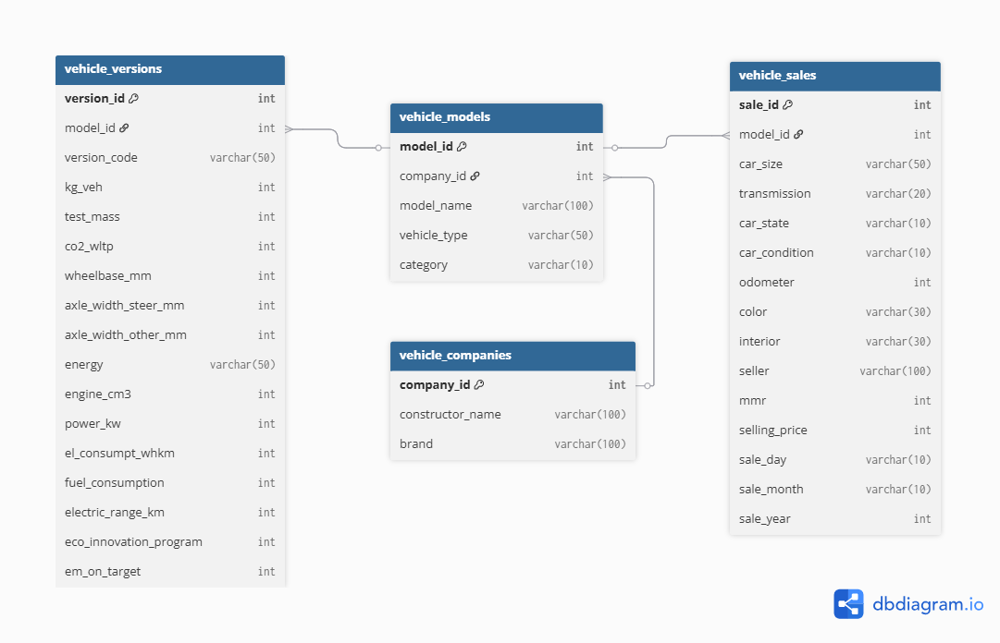

# Automotive ETL and Analysis

This repository contains an ELT and analysis pipeline for automotive data, developed for the "Advanced Database Systems" master's course.

## Data Sources

- [Vehicle Technical Specifications and Environmental Performance Dataset](https://www.opendatabay.com/data/dataset/99b921ee-d99b-414f-af61-36978fa36d92) from Opendatabay ([provider info](https://www.opendatabay.com/data-providers/805f2971-543d-4964-87bf-f7683d655b1e))
- [Vehicle Sales Cleaned](https://www.kaggle.com/datasets/krishanukalita/vehicle-sales-cleaned) from Kaggle

## Entity Relationship Diagram

- 

## Project Structure

- `setup/` — SQL scripts for schema creation, cleaning, and data loading
- `queries/` — Analytical SQL queries for reporting and insights
- `project_media/` — Project-related media files

## Setup Instructions

1. **Create Raw Tables**  
   Run [`setup/raw_tables_schemas.sql`](setup/raw_tables_schemas.sql) to create tables for raw data.

2. **Import Data**  
   Import CSV files into the raw tables using your SQL tool (e.g., Oracle SQL Developer).

3. **Clean Data**  
   Execute [`setup/clean_vehicle_data.sql`](setup/clean_vehicle_data.sql) to clean and normalize vehicle data.

4. **Create Normalized Schema**  
   Run [`setup/create_normalized_schema.sql`](setup/create_normalized_schema.sql) to set up normalized tables.

5. **Load Data**  
   Populate normalized tables by running [`setup/data_load.sql`](setup/data_load.sql).

6. **Drop Tables (if needed)**  
   Use [`setup/drop_tables.sql`](setup/drop_tables.sql) to remove tables before re-running setup.

## Analytical Queries

Find ready-to-use SQL queries in the [`queries/`](queries) folder:

- [`avg_and_std_co2.sql`](queries/avg_and_std_co2.sql): Calculates the average and standard deviation of CO2 emissions per brand.
- [`avg_and_std_km_range.sql`](queries/avg_and_std_km_range.sql): Computes the average and standard deviation of electric vehicle range per brand.
- [`best_selling_color_combo_per_brand.sql`](queries/best_selling_color_combo_per_brand.sql): Identifies the most popular color combinations for each brand.
- [`best_selling_models.sql`](queries/best_selling_models.sql): Lists the top-selling car models.
- [`electric_cars_above_avrg_range.sql`](queries/electric_cars_above_avrg_range.sql): Finds electric cars with above-average range.
- [`energy_percetange_per_brand.sql`](queries/energy_percetange_per_brand.sql): Shows the percentage distribution of energy types (e.g., electric, hybrid, fuel) per brand.
- [`hierarchical_cars_display.sql`](queries/hierarchical_cars_display.sql): Displays cars in a hierarchical structure by brand and model.
- [`hierarchical_sales_display_by_date.sql`](queries/hierarchical_sales_display_by_date.sql): Shows sales data in a hierarchical format grouped by date.
- [`odometer_sales_influence.sql`](queries/odometer_sales_influence.sql): Analyzes the influence of odometer readings on sales.
- [`rank_brands_by_green_models_distribution.sql`](queries/rank_brands_by_green_models_distribution.sql): Ranks brands by the proportion of green (eco-friendly) models.
- [`sales_and_revenue_ratio.sql`](queries/sales_and_revenue_ratio.sql): Calculates the ratio between sales volume and revenue per brand or model.
- [`vehicle_weight_price_analysis.sql`](queries/vehicle_weight_price_analysis.sql): Analyzes the relationship between vehicle weight and selling price, showing average weight, average price, and price per kilogram for each model and brand.
- [`top_worst_models_by_fuel_consumption.sql`](queries/top_worst_models_by_fuel_consumption.sql): Lists models with the best and worst fuel consumption.
- [`yearly_growth_per_brand.sql`](queries/yearly_growth_per_brand.sql): Shows yearly sales growth for each brand.
- [`vehicle_weight_price_analysis.sql`](queries/vehicle_weight_price_analysis.sql): Analyzes the relationship between vehicle weight and selling price, showing average weight, average price, and price per kilogram for each model and brand.

## Usage

- Run setup scripts in order to prepare the database.
- Use queries for analysis and reporting.
